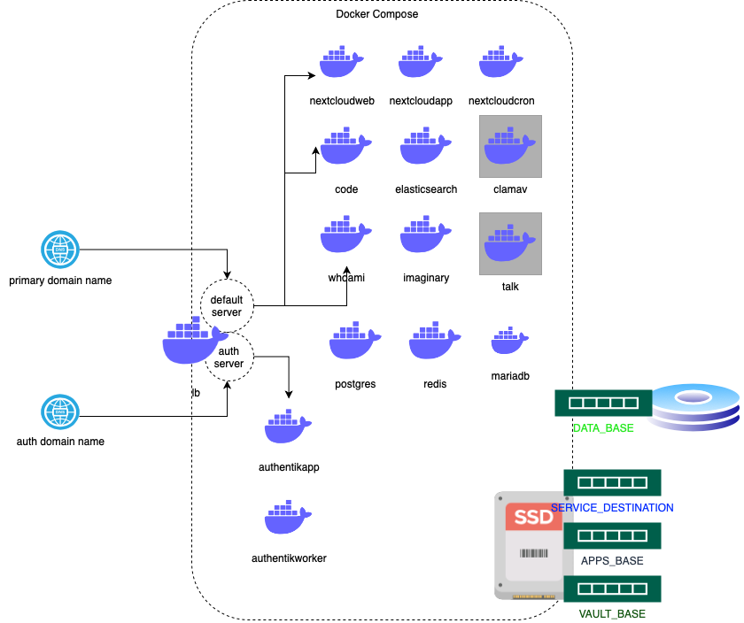

homecloud-docker
=========================
A HomeCloud service stack uses docker-compose,  deploy home cloud service(s) quickly.
This small project is directly from the thread [here](https://www.reddit.com/r/selfhosted/comments/103tbd3/comment/j95zp9b/?utm_source=share&utm_medium=web2x&context=3 )

## Services include

* Authentik
* NextCloud
* Database(MariaDB, Postgres and Redis)
* Imaginary
* ElasticSearch
* Collabora
* ClamAV(disabled by default)
* Nextcloud talk(disabled by default)

## Background and design

I have my home cloud services(primary is Nextcloud) hosted on an Ubuntu box when I plan to migrate to docker based services, I found a lot of solutions, including Nextcloud All-in-one. But according to the situation, not all of them match my requirements. For example, I have more than 15 years history data(>1TB), always kept in multiple copies in HDD, multiple disks hold the backup copies. All the disks are mounted to the Ubuntu server by USB or NAS. Then I found it is not easy for me to migrate data smoothly with docker based solution.

After some quick researching, I start this small and quiet simple project, help to resolve the issue, convert core services to docker, keep data in local volumes(HDD), at the same time, keep the base os node simple to replace or fix.

* Docker server run as computing node _ONLY_ . It is de-attached with data volumes. The box itself can be replaced quick and easy when broken
* Base OS(Ubuntu run on the node) can be setup quickly with disk volumes management(mounts), files backup and restore, network/firewall, also the Docker-CE environment
* All data keep in HDDs(USB and NAS) with multiple copies as usually, no data dump or export/import to Docker containers, my disks remained in external USB box or small NAS servers

### Deployment diagram



## Preparation and requirements

### Requirements

* Recommend hardware >2.0GHz multiple cores CPU and >8GB memory

* Ubuntu Server or Desktop >= 22.04 LTS

* Clone this repository

After install Ubuntu Server (>= 22.04) and clone the repository, run the setup script,
```
$ bin/setup.ubuntu.sh
```

Then you might need more,

* DNS Names, at least you need two, one for primary service as Nextcloud, the other for Authentication service(Authentik), e.g www.example.com and auth.example.com

* Multiple volumes or folders to mount with Docker, at least you need 4. 

For test purpose, all of them can be in one disk or even in one parent folder(*ONLY FOR TEST, NOT RECOMMEND FOR REAL WORLD*),

    1. SERVICE_DESTINATION - Service destination, the homecloud service files will store there, recommend to keep in OS SSD disk
    2. APPS_BASE - Application data volumes, recommend to keep in OS SSD disk
    3. DATA_BASE - User data, recommend to keep in HDD, this is the volume what Nextcloud used for service user files storage
    4. VAULT_BASE - Vault, a folder to host docker secret files, recommend to keep in OS SSD

For other HDD volumes, if you have, like me, used as backup, please feel free to mount or use them in base OS, docker services will NOT touch them.
For the data stores in base OS SSD disk, please keep them backup regularly.

### HTTPS certificates and acme.sh

**acme.sh is for free HTTPS certificate**, if you have commercial certificates, please ignore this.

acme.sh for free SSL certificate request and renew, keep it in base OS might be easy then in Docker and keep it out of scope the docker chain can make the docker chain more clean and easy for local development and debug.

For production deployment, acme.sh is as an option to obtain HTTPS certificates. There are also other popular solutions such as Letsencrypt.

There are two ways to enable acme.sh SSL certificate for [homecloud-docker](https://github.com/a3linux/homecloud-docker) based deployment.

1. Use self signed certificate to bootstrap or local development deployment

*bin/create_selfsigned_crt.sh* can be used to generate such certificates. The script generates *DNS_NAME*.crt and *DNS_NAME*.key in the current folder according to the input *-n DNS_NAME*, also you can give more DNS ALIAS with -a.

```
$ bin/create_selfsigned_crt.sh -n sample.com -a auth.sample.com,office.sample.com 
```
will create sample.com.crt as the certificate and sample.com.key as the private key.

After setup the deployment with self-signed certificates, you can use acme.sh to get real certificate and replace the self-signed one

2. Use acme.sh standalone mode to get the SSL certificate first, then set up the homecloud-docker configuration to kick start

#### Install acme.sh and config

```
curl https://get.acme.sh | sh -s email=my@example.com
```

More on [acme.sh document](https://github.com/acmesh-official/acme.sh/wiki/How-to-install)

Setup default CA, 

```
acme.sh --set-default-ca --server zerossl
acme.sh --set-default-ca --server letsencrypt
```

Register account for ZeroSSL(EAB),

```
acme.sh --register-account  --server zerossl \
        --eab-kid <EAB-KEY-ID> \
        --eab-hmac-key <EAB-KEY-HMAC>
```

#### Issue SSL certificate by acme.sh

Very basic issue command, 

```
acme.sh --issue -d domain.com -w ${APPS_BASE}/lb/webroot
```

${APPS_BASE}/lb/webroot is based on the homecloud.<env> file, APPS_BASE and assume the homecloud service already up.

acme.sh supports so many different modes to issue certificate. Go to [Here](https://github.com/acmesh-official/acme.sh) for more details.


## HomeCloud docker compose service quick start

### Initialize the service

* BaseOS installed and setup
* HTTPS certificate generated or obtained, if not, please check above steps
* Config the deployment config file, copy the _homecloud.env_ to homecloud.dev or homecloud.prod and put into folder according to your OS environment, e.g. <some_path>/homecloud.dev
* Run ./sync_deployment.sh -c <some_path>/homecloud.<env>, here env is dev or prod you copied above
* Go to service folder to start the service with <some_path>/bin/start.dbonly.sh 
* Create databases by run <some_apth>/bin/create_databases.sh
* Stop the service with <some_path>/bin/stop.dbonly.sh
* Start the service with <some_path>/bin/start.sh and waiting for all service up

### Setup services

#### Authentik

Go to Authentik URL https://<AUTHENTIK_SERVER_NAME>/if/flow/initial-setup/, Authentik domain name should be the one in _homecloud_.<env>, setup the akadmin user.
Start to use Authentik if everything is fine.

#### Nextcloud

* Run _config_nextcloud.sh_ for basic Nextcloud config,

```
$ ${SERVICE_DESTINATION}/bin/config_nextcloud.sh -a nextcloud
```

* Login into Nextcloud by URL *https://<PRIMARY_SERVER_NAME>/*
* The admin password is locate in *$VAULT_BASE/nextcloud_admin_password.txt*

##### Well known issue about Nextcloud App Store json load issue

WARN message in Nextcloud Administration -> Logging, 

 ```
     Could not connect to appstore: cURL error 28: Operation timed out after 60000 milliseconds with 421888 bytes received (see https://curl.haxx.se/libcurl/c/libcurl-errors.html) for https://apps.nextcloud.com/api/v1/apps.json
 ```

 Root cause of timeout, Nextcloud source code, lib/private/App/AppStore/Fetcher/Fetcher.php, line 103, $timeout => 60. I did not get reasonable solution for this. Just waiting for a while and lucky to have it.

* More Nextcloud config and apps install

For example,

```
$ ${SERVICE_DESTINATION}/bin/config_nextcloud -a fulltextsearch
```

All those can be done on Nextcloud management console too. It is not necessary to run those commands.

#### Nextcloud operation

You can always manage Nextcloud through management console(UI).
For some cases, you will need Nextcloud cli *occ* interface, in homecloud deployment environment, this is always available,

```
$ docker exec -it -u www-data homecloud_nextcloudapp php /var/www/html/occ CMD OPTIONS
```

For example to scan certain user's files, 
```
$ docker exec -it -u www-data homecloud_nextcloudapp php /var/www/html/occ files:scan user_id
```

More about Nextcloud *occ*, please go to [here](https://docs.nextcloud.com/server/latest/admin_manual/configuration_server/occ_command.html)

##### Nextcloud occ cli issue


#### Nextcloud SSO by Authentik

There are good reference online for this part, 

* [Complete Guide from Jack](https://blog.cubieserver.de/2022/complete-guide-to-nextcloud-saml-authentication-with-authentik/) 
* [Another guide](https://geekscircuit.com/nextcloud-saml-authentication-with-athentik/).

##### Basic steps

For Authentik side,
1. _GENERATE_ certificate in "System" => "Certificates" for Nextcloud, Download both certificate and private key file. Also download the authentik self-signed certificate
2. Go to "Applications" => "Providers", _CREATE_ SAML provider, PRIMARY_SERVER_NAME is the one in homecloud.<env>

```
Name: nextcloud-saml
Authorization flow: choose the implicit or explicit authorization. Explicit means the users will be asked wether they want to give their username and email address to Nextcloud before logging in, with implicit they won’t get asked.
ACS URL: https://PRIMARY_SERVER_NAME/apps/user_saml/saml/acs
Issuer: https://PRIMARY_SERVER_NAME/apps/user_saml/saml/metadata
Service Provider Binding: POST
Audience: https://PRIMARY_SERVIER_NAME/apps/user_saml/saml/metadata
Signing certificate: authentik self-signed certificate
Verification certificate: <The certificate generated in above step>
Property mappings: select all entries (default)
NameID Property mapping: User ID
the rest of the fields you can leave as they are
```

3. Go to "Applications" => "Applications", _CREATE_ application Nextcloud

For Nextcloud sied,

1. Go to "SSO & SAML authentication" app
2. Set like this,

```
- General
    Attribute to map UID to: http://schemas.goauthentik.io/2021/02/saml/username
    Display name of Identity Provider: Authentik SSO

- Service Provider Data
    Choose X509 subject name and insert the Nextcloud certificate and private key you downloaded from Authentik (the one that was generated)

- Identity Provider Data
    Identifier of the IdP: https://PRIMARY_SERVER_NAME/apps/user_saml/saml/metadata
    URL Target of the IdP where the SP will send the Authentication Request Message: https://AUTHENTIK_SERVER_NAME/application/saml/nextcloud/sso/binding/redirect/
    URL Location of IdP where the SP will send the SLO Request: https://AUTHENTIK_SERVER_NAME/if/session-end/nextcloud/
    URL Location of SLO Response: (empty)
    Public X.509 certificate of the IdP: insert the certificate you downloaded from authentik self-signed certificate

- Attribute mapping
    Attribute to map the displayname to: http://schemas.xmlsoap.org/ws/2005/05/identity/claims/name
    Attribute to map the email address to: http://schemas.xmlsoap.org/ws/2005/05/identity/claims/emailaddress
    Attribute to map the users groups to: http://schemas.xmlsoap.org/claims/Group

- Security settings

  Signatures and encryption offered
    Indicates that the nameID of the samlp:logoutRequest sent by this SP will be encrypted :white_check_mark:
    Indicates whether the samlp:AuthnRequest messages sent by this SP will be signed :white_check_mark:
    Indicates whether the samlp:logoutRequest messages sent by this SP will be signed :white_check_mark:
    Indicates whether the samlp:logoutResponse messages sent by this SP will be signed :white_check_mark:
    Whether the metadata should be signed :white_check_mark:

  Signatures and encryption required
    Indicates a requirement for the samlp:Response, samlp:LogoutRequest and samlp:LogoutResponse elements received by this SP to be signed
    Indicates a requirement for the saml:Assertion elements received by this SP to be signed
    Indicates a requirement for the saml:Assertion elements received by this SP to be encrypted
    Indicates a requirement for the NameID element on the SAMLResponse received by this SP to be present :white_check_mark:
    Indicates a requirement for the NameID received by this SP to be encrypted
    Indicates if the SP will validate all received XML :white_check_mark:
```
Finally, after you entered all these settings, a green Metadata valid box should appear at the bottom. Note that there is no Save button, Nextcloud automatically saves these settings.

* Login into Nextcloud by URL *https://<PRIMARY_SERVER_NAME>/login?direct=1* after switch to SSO enabled

#### Customization

Leave users to do.

### Backup and restore

#### Databases

The script *bin/backup_databases.sh* can be used to dump all databases for MariaDB and Postgres, also a restore_databases.sh provided for restore in case.

#### Files

We have four folders or volumes in homecloud deployment environment and backup should take care of them.

